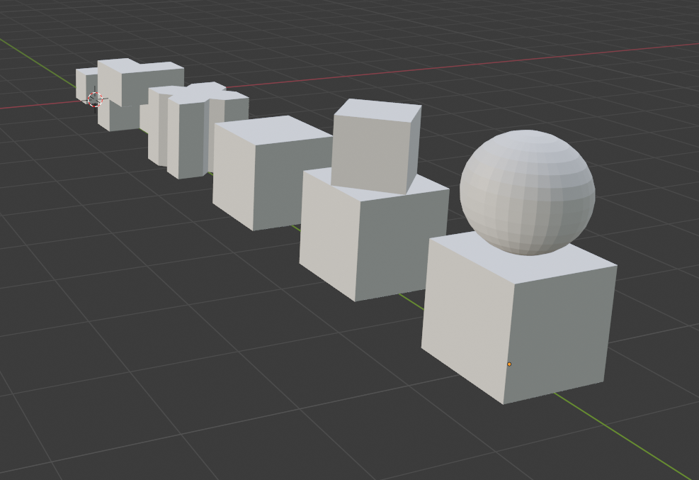
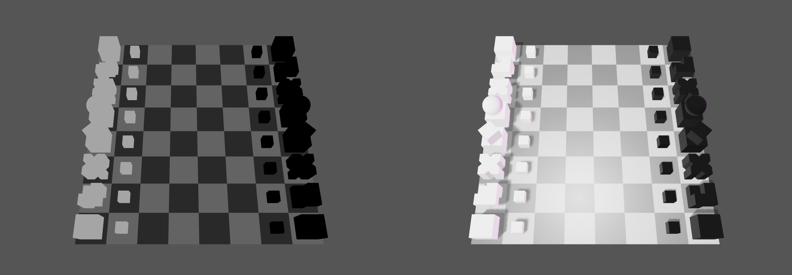

# Making of: 3D Chess in React

Recently I made a tiny demo where I implemented a subset of the chess game, made it in 3D and implemented using React exclusively for the job. It will be a quick summary of what happened and how it happened.


## Models

I some have experience with Blender so I quickly put together a set of geometric (Bauhaus style) pieces.



## Three.js in React

In order to display them I had to go for WebGL as usual with 3D rendering on the web. [Normally](https://tchayen.github.io/brief-explanation-of-webgl/) I like to do it all myself, but this time I decided that maybe instead of spending a week on proving a point that I can do it myself, I might rather finish the project.

So here we go, Three.js to make handling 3D easier than usual and `react-three-fiber` because it exists and I really want to check it out.

First thing that is mind blowing to me is that I can define Three.js in JSX. How? Custom renderers. There is a great [talk from React Conf 2019](https://conf.reactjs.org/event.html?sophiebits) that explains how it works.

What's even greater, you can mix JSX targetting this renderer with regular React for React DOM too, so Three.js elements can be nested in regular React. Although, sometimes it might be tricky to remember about all caveats that apply there. For example, rendering context is not passed to the inner renderer, so if you have a state library with a state provider outside in the React context, you will have to [pass it to the inside one](https://github.com/pmndrs/react-three-fiber/blob/master/markdown/api.md#consuming-context-from-a-foreign-provider).

This is how it looks like in practice:

```jsx
<Canvas
  concurrent
  pixelRatio={[1, 2]}
  camera={{ position: [4, 10, 0] }}
>
  <ambientLight intensity={0.3} />
  <Suspense fallback={null}>
    {/* ... */}
```

### Chessboard

Not everything has to be modeled and imported. For example chessboard is easy to achieve using simple shapes (simplified `Square.tsx`):

```jsx
<group position={[x, 0, y]}>
  <mesh>
    <boxBufferGeometry attach="geometry" args={[size, 0, size]} />
    <meshStandardMaterial attach="material" color={color} />
  </mesh>
</group>
```

It can be probably even simpler than this, since – if I remember correctly – there is `Plane` as a primitive type but I haven't looked into that too much.

## Implementing chess

Basically all game logic happens in one place here – when showing available moves. It is probably not the most readable or concise implementation you will see, but was straightforward to define and implement.

For a given coordinate, I check:
- If there is a piece there.
- What is its type.

I have a helper that checks a given direction (specified as `{ x: -1 | 0 | 1, y: -1 | 0 | 1 }`, which expresses any diagonal, horizontal or vertical movement in both directions) and goes on until:
- It goes out of the chessboard.
- It exceeds range (usually no limit, implemented as `8`, or 1 field).
- It finds another piece (if the same color then stop there, if enemy then recognize it as possible attack move).

For pawns I use an assumption (but I don't really have to worry about the rules of chess changing or getting more complex any time soon, right?) that a white pawn on `y === 6` or a black one on `y === 1` is entitled to make the initial, 2-field-long move.

I haven't implemented castling, promotion or en passant as I was able to get away with not having them for the demo video (oops).

## State updates

The game can be in one of the following states:
- Nothing is happening.
- User is hovering their piece.
- User has picked up a piece, and, as we all know after watching Queen's Gambit, they are obliged to make a move with it now (it's not a bug, it's a feature!).

As a lazy React developer, I put all the actual logic wherever the final press event is handled. It happened to be in `HoverableSquare`, as it is displayed over the fields that user can move to.

### What happens then?

I check if there is some piece on the target field (then it's an attack) or not (a move). I update my `field -> Piece | null` mapping array (most likely buggy, but works reasonably well for the first few moves).

Then the tricky part happens: `hovered` element becomes `null` (re-render alert for `<AvailableMoves />` and `<Figures />`; basically pink color disappears from the screen). Game state is updated (the changes I mentioned in the previous paragraph come to life and current turn is passed to the other player).

## Getting fancy

Presentation plays important role in any visual-heavy project. It's most likely the deciding factor for why you are actually reading this note.

I have (limited) experience with 3D modelling and wanted to finish it quickly so I went for simple tricks: directional lighting to make everything visible, shadows for realism's sake and additional point lights for fancy glares.



_You versus the chessboard she tells you not to worry about meme._

## Left to do

This demo lacks at least several things:
- Being a complete chess game (there are missing moves, there is no way to win or lose the game, nothing).
- Animations (`react-spring` should be perfect for the job).
- More UI to show what's going on.

## Thanks for reading!

Hope this was informative and met your expectations. If any part was unclear or you have any more questions feel free to mention/DM me on [Twitter](https://twitter.com/tchayen).

I think this is also a good place to thank some people without whom I wouldn't be writing this now:
- [@wojtus_7](https://twitter.com/wojtus_7), my friend who started playing with chess-oriented demo recently and inspired me to give it a try.
- [@0xca0a](https://twitter.com/0xca0a), who is the person behind `react-three-fiber`.
- [@aivandroid](https://twitter.com/aivandroid), who asked me to create a blog/video of the development process.

Have a great day!
